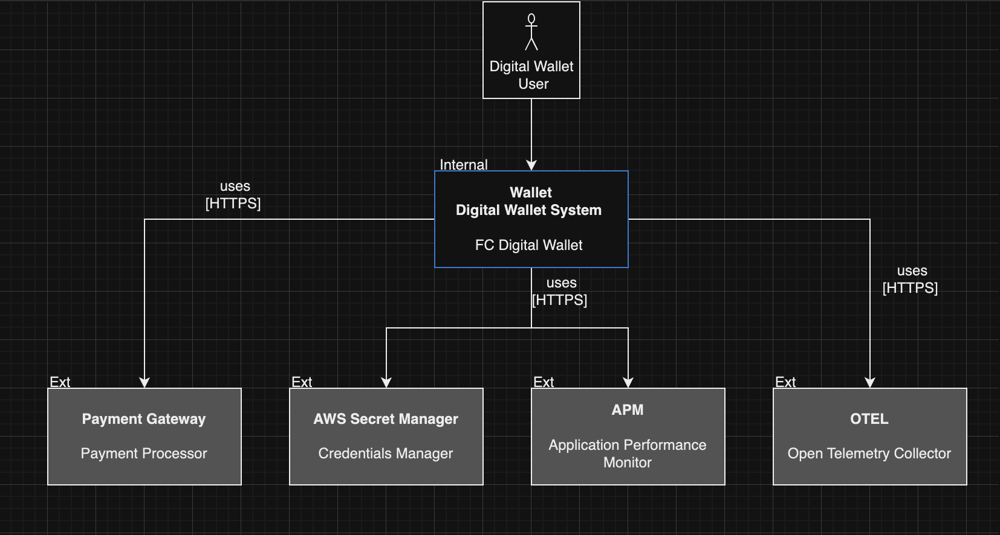

# Microservices-arch-specialist

## Characteristics of a good microservice Architecture

### Componentization via services 

- Component is a unit of software that is independently repleaceble and upgradeable.
- Services are independently deployable. 

### Organized Around Business Capabilities 

- Split teams based on business capabilities. 
- Teams are cross-functional. 

### Products Not Projects 

- Projects aim just a piece of software, with a closed scope. 
- Products are scalable.
- Team will be the owner of the product over its full lifetime. 
- Products are linked with their on capabilities and their responsabilities, and not just focused and delivery some functionality. 

### Smart endpoints and dumb pipes 

- The communication mechanism must be DUMB. 
- Microservices are decoupled. 
- Own their own domain logic. 

### Decentralized Governance

- Be able to use differents databases, languages and frameworks. 
- Contracts well defined. 
- You build it / you run it 

### Decentralized Data Management

- Duplicate data when necessary. 
- Each system has his own database. 

### Infra Automation 

- Automated test 
- Automated deploy 

### Design for failure 

- Expect dependencies error. 
- Monitoring, Alerts, resilience. 

### Evolutionary Design 

- Be able to change and upgrade my system without impact other MS. 
- Be able to replace one ms without impact archtecture.

#### More details - https://martinfowler.com/articles/microservices.html

## Resilience 

#### Intentional Adapt to failure 

#### Strategic approach to minimize risk of losing data, losing transactions and avoid impacting infrastructure 

#### Response time should not change. 

#### Do not make requests to another system that is not healthy. Dont be selfish. 

### Health Check

- Always make sure that your system and their dependencies are healthy.
- Avoid request to systems that are not healthy. 
- Self-healing - an unhealthy system that is not receiving more requests can be healthy after some minutes. 

### Rate limiting 

- Protect the system based on the number of requests is was designed to handle.
- It should be based on each customer, focusing on the most important customers. 

### Circuit Braker 

- Protect the system returning error when the system is not healthy. 
- Circuit closed - requests are processed normally.
- Circuit Open - No requests are processed. Always returns an error. 
- Half open Circuit - Allows a limited amount of requests to be processed focused on verify if system has condition to close the circuit again. 

### Api Gateway 

- Ensures that inappropriate requests do not reach the system.
- implements rate limiting, Health check and etc: 
        - Just necessary to create an endpoint that checks the application status and the api gateway will make requests and make sure to protect the api based on that. 
- Organize microservices in contexts. 

### Service Mesh

- Traffic control.
- mTLS 
- Circuit Breaker, retry, timeout, fault injection and etc. 

### Async first 

- Use message brokers / queues always as possible 

### Retry 

- use exponencial backoff and jitter

### Transactional Outbox 

- Register on a temporary table the messages that you pretend to send to kafka and remove after succeed.

### Idempotency is fundamental 

### Fallback policy must be clear

### Observability 

- APM (application performance Management)
- Distributed Trace
- Custom Metrics 
- Spans 

## Patterns 

### API Composition - Data Composition

- Use service composer to build information. 
- Able to compose information of different sources. 

- Tradeoff: Increase complexity by creating a service to read other services, Problems with unavailability of dependencies and data consistency. Increase latency. 

### API Composition - Business Rules 

- Use service composer to handle and process other resources. 
- Resilience is fundamental. 

### Decompose by business capability 

- Spread monolithic by business capability 
- Domain Driven Design -> Bounded contexts 

###  Strangler Application

- Every new feature is a new MS. 
- While create new features in MSs, broke monolithic.
- Tradeoffs: Comunication with monolithic, necessary a devops culture. 
- https://microservices.io/patterns/refactoring/strangler-application.html 

### ACL - Anti-corruption layer

- Used to prevent that one monolith domain model from polluting the domain model of a new service.
- A service which translates between two domain models.
- ex: a interface that implements many payment gateway, but expose just one interface. 
- obs: its a service and can contain the rules to choose the best gateway or even provides the capability to chose.

### API-Gateway 

- Single entrypoint for MSs. 
- Implements security, rate limiting. 
- Can transform and adapt data. 
- Authentication.

### BFF - Back for front 

- used to prevent that no necessary data is provided to clients. 
- One service for each type of client(mobile, TV, Desktop, WEB), with the responsability to access MSs and provide just the necessary data. 
- Can be replaced by using GraphQL(???) 

### Database per service

- Private-tables-per-service, each service owns a set of tables that must only be accessed by that service
- Schema-per-service, each service has a database schema that’s private to that service
- Database-server-per-service, each service has it’s own database server.
- Helps ensure that the services are loosely coupled. Changes to one service’s database does not impact any other services.
- Each service can use the type of database that is best suited to its needs. For example, a service that does text searches could use ElasticSearch. A service that manipulates a social graph could use Neo4j.

#### Reports and info consolidation

- options: 
        - Generate the report on background and make MSs consolidate the information.
        - Create a reports micro-service. 
        - Generate a projected table of reports that can be update by Reports MS or by each MS. Reports-MS may will listening the events and update the reports table. 

### Transactional Outbox 

- before proccess save the data / request in a table, if the proccess is successful remove the data / request from the table.
- have a proccess that read this table and tries to proccess, when successful remove data from table. 
- can use a RDMBS(separated Schema), KVS(dynamoDB, MongoDB), Cache (REDIS). 

#### Secret Manager / Vault 

- Service that maintain the credentials and update the keys using some service like lambda. 

#### Logs 

- Standardize logs 
- SDK 

# C4 - Context 

# C4 - Container